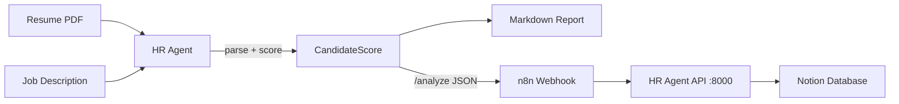

# 🤖 AI Employee OS

> 人工智能员工操作系统 | AI Employee Operating System


> Open-source AI Employee framework for building practical AI agents with LLMs and workflow automation.

> 开源人工智能员工框架，用于构建企业级 AI Agent 与自动化工作流。

---

## ✨ What's included

The **HR Agent Edition** automates the first round of recruitment:

- 📄 **Resume parsing** — extracts text from PDF and structures it with OpenAI
- 🎯 **JD matching** — scores candidates across skills / experience / culture / growth
- 📊 **Scoring report** — markdown report with strengths, risks, and a clear recommendation
- 🖥️ **Demo UI** — a Streamlit app for non-technical reviewers
- 🔁 **n8n automation** — an end-to-end webhook → API → Notion pipeline

## 🗺️ Architecture



## 📁 Project structure

```
AI-Employee-OS
├── agents
│   └── hr-agent
│       ├── prompts
│       │   └── system_prompt.md
│       ├── app.py            # core agent + /analyze server
│       ├── ui.py             # Streamlit demo UI
│       ├── requirements.txt
│       ├── .env.example
│       └── README.md
├── workflows
│   └── n8n
│       └── hr-agent-workflow.json
├── demo
│   └── recording-script.md  # 3-min demo video script
├── examples
│   ├── sample_output.md
│   └── sample_jd.txt
├── docs
│   └── submission.md         # award submission copy
├── .gitignore
├── LICENSE
└── README.md
```

## 🚀 Quick Start

```bash
# 1. Clone
git clone https://github.com/wbh349/AI-Employee-OS.git
cd AI-Employee-OS

# 2. Install dependencies (they live in agents/hr-agent/)
pip install -r agents/hr-agent/requirements.txt

# 3. Configure your OpenAI key
cp agents/hr-agent/.env.example .env
#   then edit .env and set OPENAI_API_KEY=sk-...

# 4a. Run a one-off analysis from the CLI
python agents/hr-agent/app.py \
  --resume examples/sample_resume.pdf \
  --jd examples/sample_jd.txt

# 4b. Or launch the Streamlit demo UI
streamlit run agents/hr-agent/ui.py

# 4c. Or start the HTTP server for the n8n workflow
python agents/hr-agent/app.py --serve   # listens on :8000/analyze
```

> Windows users: the repo uses standard folder names (`demo/`, `workflows/n8n/`).
> Older clones that contained spaces in those paths have been fixed.

## 🔌 API contract (`/analyze`)

`POST http://localhost:8000/analyze`

```json
{ "resume_base64": "<base64 PDF>", "job_description": "<JD text>", "company_context": "<optional>" }
```

Returns:

```json
{
  "name": "Jane Doe",
  "overall_score": 87,
  "strengths": ["...", "..."],
  "risks": ["...", "..."],
  "recommendation": "Advance to interview",
  "match_breakdown": { "skills_match": 90, "experience_match": 85, "culture_fit": 82, "growth_potential": 88 }
}
```

## 🛣️ Roadmap

- [x] HR Agent — resume screening & candidate evaluation
- [ ] Sales Agent — lead qualification & outreach
- [ ] Content Agent — blog & social media generation
- [ ] Data Agent — data analysis & reporting

## 📄 License

MIT License — see [LICENSE](LICENSE) for details.
