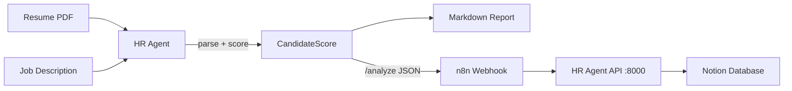

# OphenAI Developer Award - Project Submission

> ⚠️ Before submitting, replace `[Your Name]` below and paste your final demo video link into the `### Video Walkthrough` section.

## Project Information

| Field | Details |
|-------|---------|
| **Project Name** | AI Employee OS - HR Agent Edition |
| **Repository** | https://github.com/wbh349/AI-Employee-OS |
| **Category** | AI Agent / Business Automation |
| **Tech Stack** | Python, OpenAI API, Streamlit, n8n |

---

## Executive Summary

**AI Employee OS** is an open-source framework for building practical AI agents for business workflows.

This submission features the **HR Agent Edition** — an AI-powered recruitment assistant that automates resume screening and candidate evaluation. The system parses resumes, matches candidates against job descriptions, generates comprehensive scoring reports, and integrates with n8n for end-to-end workflow automation.

**One-line pitch:**
> AI Employee OS helps developers build business automation agents using LLMs and workflows.

---

## Problem Statement

### The Problem

Recruitment teams spend **60-80% of their time** screening resumes and shortlisting candidates. This manual process is:
- **Time-consuming**: HR professionals spend hours reviewing resumes
- **Inconsistent**: Different reviewers apply different criteria
- **Slow**: Time-to-hire is extended by manual screening
- **Inefficient**: High-quality candidates may be overlooked due to human bias

### Our Solution

AI Employee OS - HR Agent Edition automates the initial screening process by:
1. **Parsing** resumes using AI
2. **Matching** candidates against job requirements
3. **Scoring** candidates with transparency
4. **Generating** actionable insights for hiring managers
5. **Automating** the workflow via n8n integration

---

## Technical Architecture

### System Overview



### Key Components

#### 1. HR Agent Core (`agents/hr-agent/app.py`)
- **Resume parsing**: Extracts text from PDF files using pypdf
- **Structured extraction**: Uses OpenAI GPT-4o-mini to parse resumes into structured JSON
- **Intelligent scoring**: Evaluates candidates across 4 dimensions (Skills, Experience, Culture, Growth)
- **Report generation**: Produces markdown reports with strengths, risks, and interview recommendations
- **HTTP server**: A built-in `POST /analyze` endpoint (stdlib `http.server`, no extra dependency) lets n8n call the agent

#### 2. System Prompt (`agents/hr-agent/prompts/system_prompt.md`)
- Defines the agent's role as an AI HR specialist
- Establishes evaluation framework with weighted criteria
- Standardizes output format for consistency
- Provides example outputs for quality benchmarks

#### 3. Demo UI (`agents/hr-agent/ui.py`)
- A Streamlit app for non-technical users / live demos
- Upload a resume, paste a JD, click **Analyze** — get the score report instantly

#### 4. Workflow Automation (`workflows/n8n/hr-agent-workflow.json`)
- n8n webhook (`POST /resume-screening`) receives a base64 resume + JD
- Triggers the HR Agent via `POST http://localhost:8000/analyze`
- Saves the analysis report to a Notion database
- Enables end-to-end automation without manual intervention

#### 5. Environment Configuration
- `.env.example` provides secure API key management
- `requirements.txt` lists all Python dependencies (core + optional UI)
- Quick start commands for immediate testing

---

## Technical Details

### AI Integration

**Model**: OpenAI GPT-4o-mini
**API**: OpenAI Python SDK v1.0+
**Features**:
- Structured JSON output (`response_format: json_object`)
- Custom system prompts for role-specific behavior
- Temperature optimization for consistent results

### Code Quality

| Metric | Value |
|--------|-------|
| Python Version | 3.11+ |
| Core dependencies | 3 (openai, pypdf, python-dotenv) |
| Optional dependencies | 1 (streamlit, demo UI only) |
| Type Hints | Yes |
| Example Data | Yes |
| Runnable CLI | Yes |
| HTTP API | Yes (`/analyze`) |

### Architecture Principles

1. **Modular**: Each component is independently replaceable
2. **Configurable**: Environment variables for API keys and endpoints
3. **Extensible**: Easy to add new agents for different business functions
4. **Open Source**: MIT license for maximum reusability

---

## Demonstration

### Video Walkthrough

**[Paste your demo video link here — YouTube or Vimeo, ~3 minutes]**

> Tip: follow `demo/recording-script.md` for a scene-by-scene shooting guide.

### What the Demo Shows

| Timestamp | Content |
|-----------|---------|
| 0:00-0:30 | Introduction and project overview |
| 0:30-1:30 | Core Agent demonstration (resume upload → AI analysis → report generation) |
| 1:30-2:00 | Detailed report review (scoring breakdown, strengths, risks, recommendations) |
| 2:00-2:45 | n8n automation workflow demonstration |
| 2:45-3:00 | Closing and call to action |

### Sample Output

See [`examples/sample_output.md`](examples/sample_output.md). A representative result:

```markdown
# Candidate Report: Jane Doe
**Overall Score:** 87/100

## Strengths
- 5+ years AI/ML experience
- OpenAI API expertise
- Full-stack Python
- Team leadership

## Risks
- Limited RAG experience
- No LangChain exposure
- Gap in MLOps

## Recommendation: **Advance to Interview**

## Match Breakdown
- skills_match: 90/100
- experience_match: 85/100
- culture_fit: 82/100
- growth_potential: 88/100
```

---

## Use Cases

### Primary Use Case: Recruitment Screening
HR teams can automate the initial candidate screening process, reducing time-to-hire and improving consistency.

### Extendable Use Cases

| Agent | Function |
|-------|----------|
| **HR Agent** (✅ Complete) | Resume screening, candidate evaluation, interview recommendations |
| **Sales Agent** (Planned) | Lead qualification, outreach personalization, meeting scheduling |
| **Content Agent** (Planned) | Blog generation, social media content, SEO optimization |
| **Data Agent** (Planned) | Data analysis, reporting, dashboard generation |

---

## Open Source Value

### For Developers
- **Fork and customize**: Use as a starting point for AI agent development
- **Learn from examples**: See how to integrate OpenAI with real business logic
- **Extend**: Add new agents by following the same pattern
- **Contribute**: Open issues and PRs welcome

### For Companies
- **Deploy immediately**: Ready-to-use solution for HR teams
- **Customize**: Adapt to specific business needs
- **Integrate**: n8n workflow connects to existing tools (Notion, email, etc.)
- **Cost-effective**: Pay only for OpenAI API usage (no licensing fees)

### Community Value
- MIT licensed
- Complete documentation
- Example data included
- Roadmap for future development
- Contributions welcome

---

## What Makes This Different

### Not Just a Chatbot
This is a **task-oriented AI agent** that performs a specific business function with measurable outcomes.

### Workflow Integration
Unlike standalone demos, this project includes **n8n automation**, making it ready for production deployment.

### Developer-First
The code is designed to be:
- **Readable**: Clear comments and type hints
- **Testable**: Modular functions with clear inputs/outputs
- **Extensible**: Easy to add new agents

### Business Value
Demonstrates practical ROI by solving a real HR problem rather than just demonstrating API usage.

---

## Future Plans

### Short-term
- [ ] Add Streamlit UI for non-technical users ✅ (shipped in `ui.py`)
- [ ] Support for multiple resume formats (.docx, .txt)
- [ ] Integration with LinkedIn API
- [ ] Candidate database storage

### Long-term
- [ ] Multi-agent orchestration
- [ ] Custom training on company hiring data
- [ ] Bias detection and mitigation
- [ ] Full ATS integration

---

## Acknowledgments

- Built with [OpenAI API](https://openai.com/)
- Workflow automation via [n8n](https://n8n.io/)
- Demo UI via [Streamlit](https://streamlit.io/)
- Powered by the Python open-source ecosystem

---

## Contact

**Developer**: [Your Name]
**GitHub**: [wbh349](https://github.com/wbh349)
**Project**: [AI-Employee-OS](https://github.com/wbh349/AI-Employee-OS)

---

*Submitted for the OphenAI Developer Award - 2026*
